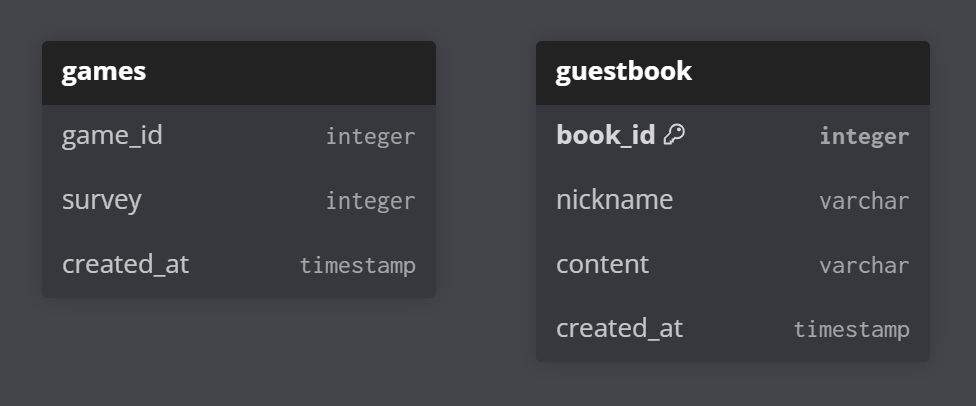
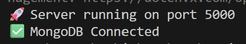

# TemiMate_BE
뚜벅 Temi 프로젝트 백엔드 Repository 

<br />

## 목차
- [DB 구조](#DB-구조)
- [실행 방법](#실행-방법)

<br />

## DB 구조 

- game_id 범위 : 0 ~ 3 (게임 4가지)
    - 0 : 가위바위보 
    - 1 : 밸런스 게임
    - 2 : OX 퀴즈
    - 3 : 룰렛 

- survey 범위 : 1 ~ 5 (만족도)

<br />

## 실행 방법
### 1. MongoDB 회원가입/로그인 필요
```
https://www.mongodb.com/products/platform/atlas-database 
```

<br />

### 2. 해당 repository 로컬 환경으로 clone 
```
git clone https://github.com/0wkim/TemiMate_BE.git
```

<br />

### 3. 실행 환경 install
```
npm i 
```

<br />

### 4. 실행 및 접속 확인 
```
npm start
```
사진과 같은 메시지가 Terminal 창에 찍히면 잘 연결된 것 



<br />

### 5. FE에서 연결

#### 연결 예시 - 방명록 조회
```
const res = await fetch("http://localhost:5000/api/guestbook");
const data = await res.json();
console.log(data);
```

<br />

#### 연결 예시 - 게임 만족도 저장
```
await fetch("http://localhost:5000/api/games", {
  method: "POST",
  headers: { "Content-Type": "application/json" },
  body: JSON.stringify({
    game_id: 2,
    survey: 5
  })
});
```
